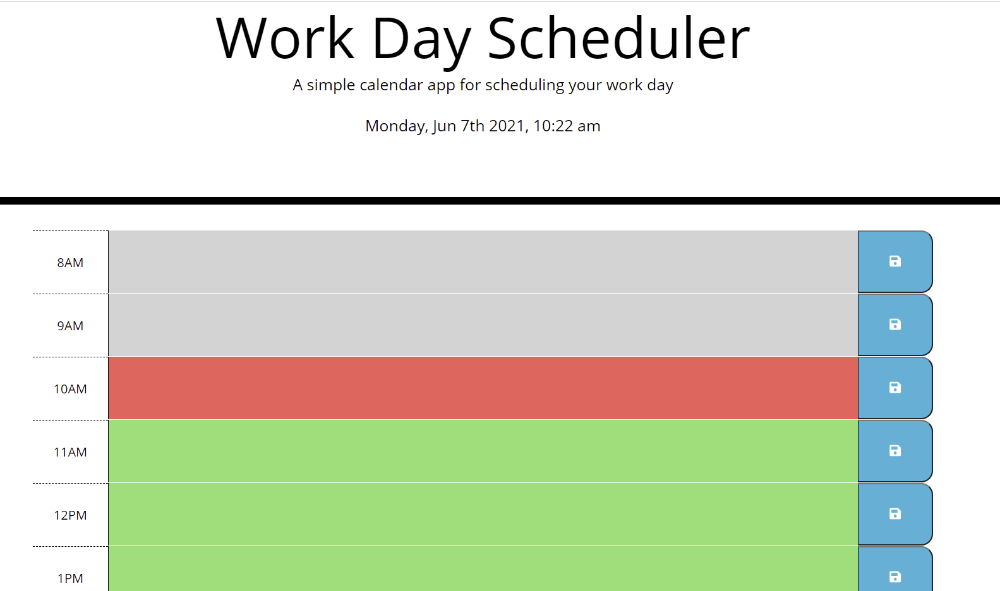
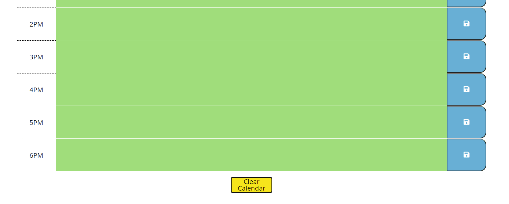

# 05 Third-Party APIs: Work Day Scheduler

## Your Task

Create a simple calendar application that allows a user to save events for each hour of the day by modifying starter code. This app will run in the browser and feature dynamically updated HTML and CSS powered by jQuery.

You'll need to use the [Moment.js](https://momentjs.com/) library to work with date and time. Be sure to read the documentation carefully and concentrate on using Moment.js in the browser.

## Goals

- WHEN I open the planner the current day is displayed at the top of the calendar
- WHEN I scroll down, I am presented with timeblocks for standard business hours
- WHEN I view the timeblocks for that day, each timeblock is color coded to indicate whether it is in the past, present, or future
- WHEN I click into a timeblock, I can enter an event
- WHEN I click the save button for that timeblock, the text for that event is saved in local storage
- WHEN I refresh the page, the saved events persist

## Technologies Used
- HTM
- CSS
- jQuery

## Screen Shot

## Links

- The URL of the deployed application: https://gbutler3.github.io/Work_Day-Schedule_Mini_Project/

- The URL of the GitHub repository: https://github.com/gbutler3/Work_Day-Schedule_Mini_Project
